# Diffusion-Based Counterfactual ECG Generation for Atrial Fibrillation Data Augmentation

[](https://opensource.org/licenses/Apache-2.0)
[](https://www.python.org/downloads/)
[](https://pytorch.org/)
[](https://huggingface.co/TharakaDil2001/diffusion-ecg-augmentation)
[](https://huggingface.co/spaces/TharakaDil2001/ecg-augmentation-demo)

*Final Year Research Project — Group 29*  
*Department of Computer Engineering, University of Peradeniya, Sri Lanka*  
*2024–2025*

> **[Project Page](https://cepdnaclk.github.io/e20-fyp-ai-atrial-fib-detection/)** · **[Paper (IEEE)](diffusion_pipeline/paper/paper.pdf)** · **[Model Hub](https://huggingface.co/TharakaDil2001/diffusion-ecg-augmentation)** · **[Live Demo](https://huggingface.co/spaces/TharakaDil2001/ecg-augmentation-demo)**

---

## Institutional Collaboration

This research is conducted through an international collaboration as part of the EU-funded **[SEARCH Initiative](https://www.search-project.eu/)** for cardiovascular AI research:

| Institution | Role |
|---|---|
| University of Peradeniya, Sri Lanka | Lead research institution |
| SimulaMet, Oslo, Norway | Co-supervision, research infrastructure |
| University of Maryland, College Park, USA | Collaborator |
| Tulane University School of Medicine, USA | Clinical advisory |
| University of Copenhagen, Denmark | Clinical advisory |

### Research Team

**Student Researchers:**

| Name | Registration | Email | Links |
|---|---|---|---|
| Tharaka Dilshan | E/20/069 | [e20069@eng.pdn.ac.lk](mailto:e20069@eng.pdn.ac.lk) | [](https://orcid.org/0009-0006-1672-2317) [](https://www.linkedin.com/in/tharaka-dilshan-237a8b345/) |
| Nethmini Karunarathne | E/20/189 | [e20189@eng.pdn.ac.lk](mailto:e20189@eng.pdn.ac.lk) | [](https://orcid.org/0009-0009-5459-7846) [](https://www.linkedin.com/in/nethmini-karunarathne-b20460206/) |

**Supervisors:**

| Name | Affiliation | ORCID |
|---|---|---|
| **Dr. Vajira Thambawita** | SimulaMet, Oslo, Norway | [](https://orcid.org/0000-0001-6026-0929) |
| **Prof. Mary M. Maleckar** | Tulane University / Simula Research Laboratory | [](https://orcid.org/0000-0002-7012-3853) |
| Dr. Roshan Ragel | University of Peradeniya | [](https://orcid.org/0000-0002-4511-2335) |
| Dr. Isuru Nawinne | University of Peradeniya | [](https://orcid.org/0009-0001-4760-3533) |

**Collaborators:**

| Name | Affiliation | ORCID |
|---|---|---|
| Isuri Devindi | University of Maryland, College Park, USA | [](https://orcid.org/0009-0005-6615-7937) |
| Prof. Jørgen K. Kanters | University of Copenhagen, Denmark | [](https://orcid.org/0000-0002-3267-4910) |

---

## Overview

Atrial fibrillation (AFib) is the most common sustained cardiac arrhythmia, affecting over 37 million individuals worldwide. Deep learning classifiers for AFib detection require large, balanced ECG datasets, yet clinical data remains scarce, imbalanced, and constrained by privacy regulations.

This research presents a **diffusion-based data augmentation pipeline** that generates synthetic ECG segments by transforming existing recordings into **counterfactual waveforms of the opposing class**. The pipeline uses:

- **Partial-noise conditional denoising** with classifier-free guidance
- A **content-style disentangled UNet** that separates class-invariant morphology from class-discriminative rhythm features
- A **multi-stage plausibility validator** enforcing morphological, physiological, and clinical directionality constraints

### Key Result

We demonstrate that **replacing 33% of real training data with diffusion-generated synthetic ECGs does not degrade classifier performance** — validated through 5-fold cross-validation and formal statistical equivalence testing (TOST, p = 0.007).

| Training Regime | Composition | Accuracy | F1 Score | AUROC |
|---|---|---|---|---|
| **A** — Original only | 18,681 real ECGs | 95.63 ± 0.33% | 95.65 ± 0.35% | 98.90 ± 0.16% |
| **B** — Counterfactual only | 7,784 CFs (×3) | 85.94 ± 1.32% | 86.70 ± 1.24% | 93.24 ± 1.47% |
| **C** — Augmented mixture | 67% real + 33% synthetic | 95.05 ± 0.50% | 95.09 ± 0.46% | 98.60 ± 0.17% |

> **Regime C is statistically equivalent to Regime A** (accuracy gap: 0.58%, TOST p = 0.007, Δ = ±2%), and **zero near-copies** of training data were found among the accepted counterfactuals (max correlation: 0.30), confirming the generated signals are novel and privacy-preserving.

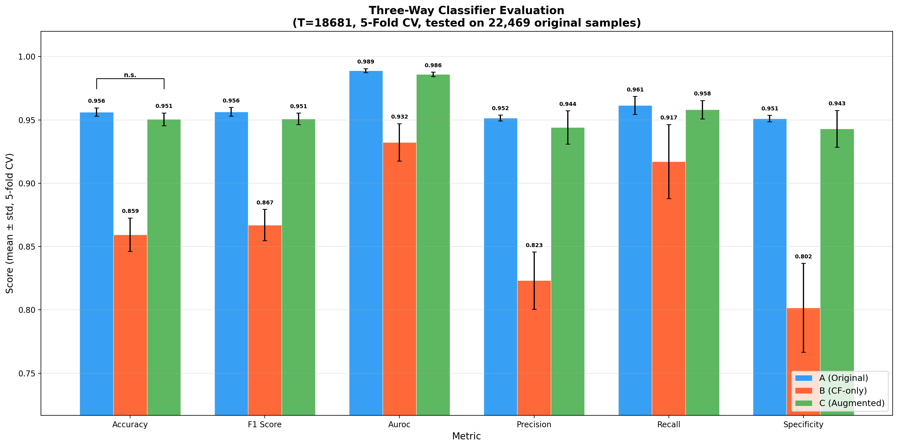

---

## Pipeline Architecture

The pipeline trains a content-style disentangled diffusion model to generate synthetic ECGs, then validates their quality through multi-gate plausibility filtering, and finally evaluates augmentation utility through a three-regime protocol.

```
┌─────────────────────────────────────────────────────────────────────────┐
│  1. DATA PREPARATION                                                    │
│     MIMIC-IV ECG → Lead II → Resample (250 Hz) → Bandpass (0.5–40 Hz) │
│     → Normalize [-1.5, 1.5] → Patient-level split (70/15/15)          │
│     Output: 104,855 train / 22,469 val / 22,469 test segments          │
└─────────────────────────────────┬───────────────────────────────────────┘
                                  │
┌─────────────────────────────────▼───────────────────────────────────────┐
│  2. AFIB CLASSIFIER (ResNet-BiLSTM)                                     │
│     Focal loss (α=0.65, γ=2.0) → Frozen after training                 │
│     Used for: flip verification + style encoder guidance                │
└─────────────────────────────────┬───────────────────────────────────────┘
                                  │
┌─────────────────────────────────▼───────────────────────────────────────┐
│  3. DIFFUSION MODEL TRAINING (Two-Stage)                                │
│                                                                         │
│     Input ECG x₀ ──┬── Content Encoder (CNN+VAE) → c ∈ ℝ²⁵⁶           │
│                     └── Style Encoder (CNN+InstanceNorm) → s ∈ ℝ¹²⁸    │
│                                                                         │
│     Stage 1 (Epochs 1–50):  Reconstruction                             │
│       Loss = L_diff (MSE) + L_cls (CE) + L_KL                          │
│                                                                         │
│     Stage 2 (Epochs 51–100): Counterfactual fine-tuning                │
│       Loss = L_diff + L_flip (frozen classifier) + L_morph (MSE to x₀) │
│                                                                         │
│     Conditional 1D UNet with classifier-free guidance (10% dropout)     │
└─────────────────────────────────┬───────────────────────────────────────┘
                                  │
┌─────────────────────────────────▼───────────────────────────────────────┐
│  4. COUNTERFACTUAL GENERATION & FILTERING                               │
│     Partial-noise init (strength=0.6) → DDIM denoising (50 steps)      │
│     → CFG scale w=3 → Savitzky-Golay smoothing                         │
│                                                                         │
│     Gate 1: Flip verification (classifier must predict target class y') │
│     Gate 2: Plausibility score P ≥ 0.7                                  │
│       P = 0.3·M(morphology) + 0.3·Φ(physiology) + 0.4·C(clinical dir.) │
│                                                                         │
│     Output: 7,784 accepted CFs / 22,469 generated (34.6% acceptance)   │
└─────────────────────────────────┬───────────────────────────────────────┘
                                  │
┌─────────────────────────────────▼───────────────────────────────────────┐
│  5. THREE-REGIME EVALUATION                                             │
│     5-fold cross-validation on held-out test set (22,469 original ECGs) │
│       A: Train on originals only                                        │
│       B: Train on counterfactuals only (×3 with noise)                  │
│       C: Train on 67% original + 33% counterfactual                     │
│     Statistical testing: TOST equivalence, Non-inferiority, Dunnett's   │
└─────────────────────────────────────────────────────────────────────────┘
```

---

## Results

### Generated Counterfactual ECG Examples

Each counterfactual ECG is generated via partial-noise initialization (60% noise), 50 DDIM steps with classifier-free guidance (scale 3.0), and filtered by the multi-stage plausibility validator (threshold 0.7).

| **AFib → Normal Sinus Rhythm** | **Normal Sinus Rhythm → AFib** |
|---|---|
|  | 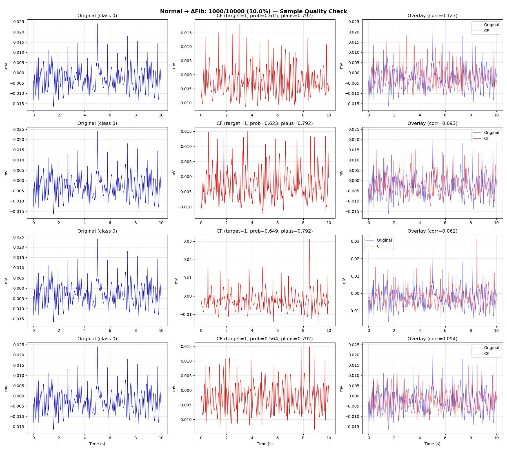 |
| 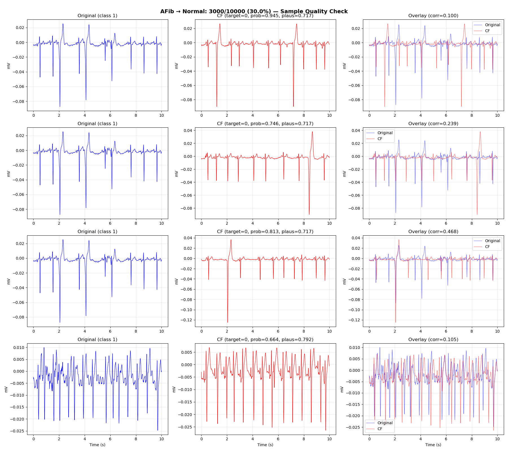 | 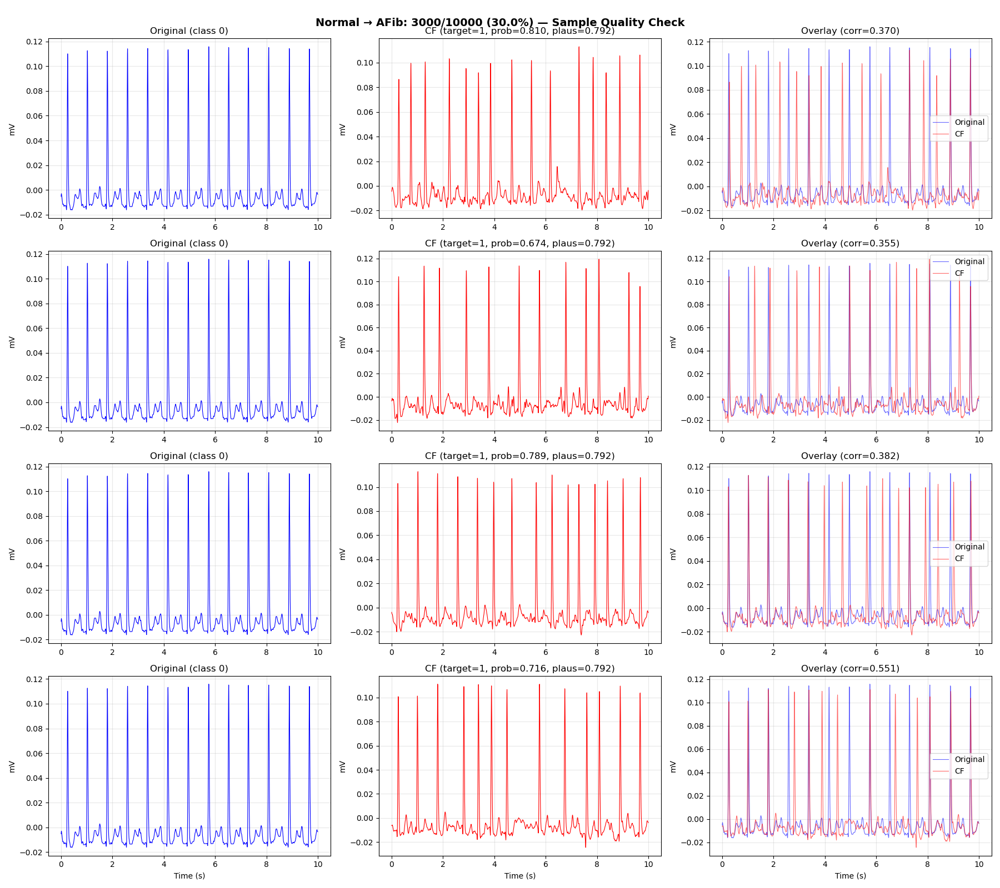 |

> 40 counterfactual examples available in [`diffusion_pipeline/final_pipeline/results/figures/counterfactual_examples/`](diffusion_pipeline/final_pipeline/results/figures/counterfactual_examples/)

### ECG Comparison


*Counterfactual ECG transformations. Normal→AFib (top rows) and AFib→Normal (bottom rows). Left: original; center: generated CF; right: overlay with Pearson correlation. Green badges show classifier predictions confirming successful class conversion.*

### Training Progress

**Stage 1** (epochs 1–50) trains reconstruction. **Stage 2** (epochs 51–100) introduces counterfactual fine-tuning.

| End of Stage 1 (Epoch 50) | End of Stage 2 (Epoch 100) |
|---|---|
|  |  |

### Signal Quality & Clinical Feature Analysis

| Metric | Overall | AFib → Normal | Normal → AFib |
|--------|---------|---------------|---------------|
| PSNR (dB) | 12.58 ± 2.09 | 12.32 ± 1.85 | 12.83 ± 2.28 |
| SSIM | 0.471 ± 0.110 | 0.460 ± 0.096 | 0.480 ± 0.121 |
| Plausibility Score | 0.76 ± 0.04 | — | — |
| Max Nearest-Neighbor Correlation | 0.30 ± 0.07 | — | — |

| Signal Quality Distributions | Clinical Feature Analysis |
|---|---|
|  |  |

### Augmentation Evaluation (5-Fold Cross-Validation)

All classifiers evaluated on the same held-out test set of 22,469 original ECGs.

| Performance Comparison | ROC Curves |
|---|---|
|  | 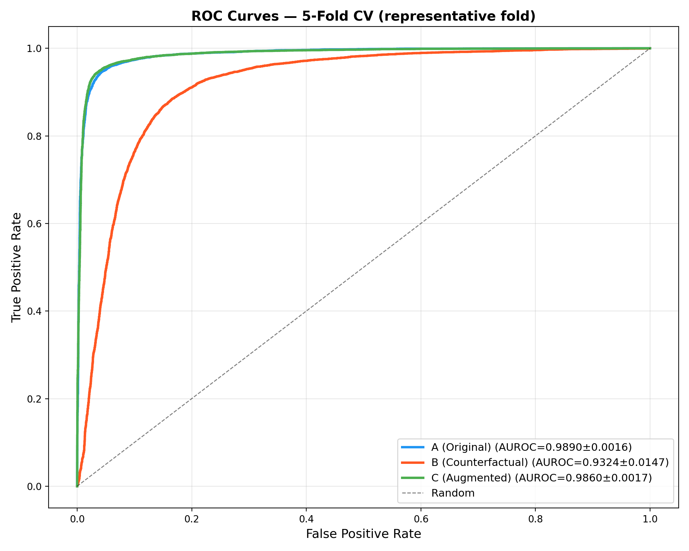 |

| Confusion Matrices | Training Curves |
|---|---|
| 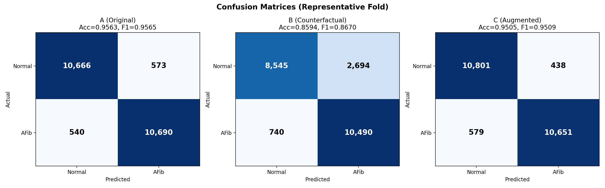 | 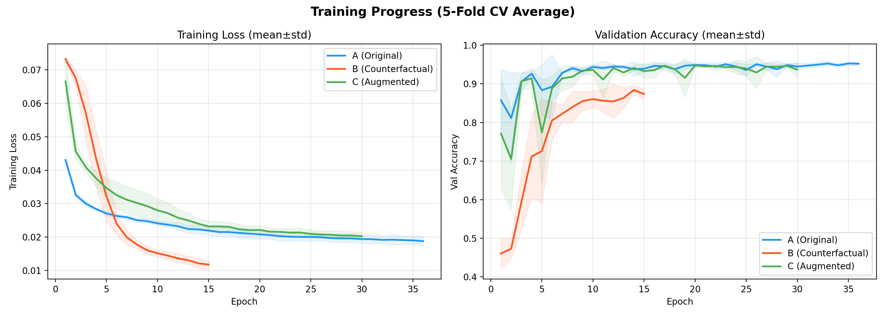 |

### Statistical Equivalence Testing (TOST)

| Test | N | Result | p-value |
|---|---|---|---|
| McNemar's test | 22,469 | Δ = 0.54% | < 0.001 |
| TOST equivalence (±2%) | 22,469 | **Equivalent** | < 0.001 |
| Non-inferiority (2%) | 22,469 | **Non-inferior** | < 0.001 |
| Dunnett's (A vs C) | 5 | No sig. diff. | 0.340 |
| Dunnett's (A vs B) | 5 | Sig. diff. | < 0.001 |

**Conclusion:** Filtered counterfactuals can safely supplement training data without measurable performance loss.

| Augmentation Viability | Pairwise Differences |
|---|---|
| 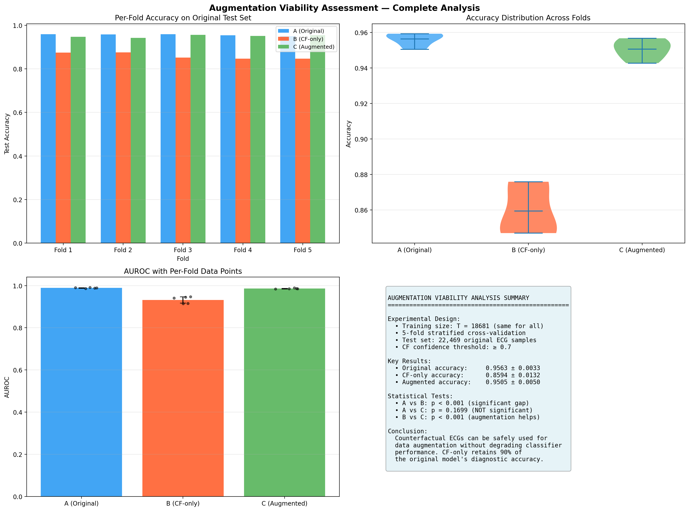 |  |

---

## Dataset

| Property | Value |
|----------|-------|
| Source | [MIMIC-IV ECG](https://physionet.org/content/mimic-iv-ecg/1.0/) (PhysioNet) |
| Lead | Lead II |
| Sampling rate | 250 Hz (resampled from 500 Hz) |
| Segment length | 10 seconds (2,500 samples) |
| Normalization | Global min-max to [−1.5, 1.5] |
| Filtering | Bandpass 0.5–40 Hz (NeuroKit2) |

| Partition | Segments | Normal / AFib |
|---|---|---|
| Training | 104,855 | 52,447 / 52,408 |
| Validation | 22,469 | 11,239 / 11,230 |
| Test | 22,469 | 11,239 / 11,230 |
| **Total** | **149,793** | **74,925 / 74,868** |

| Dataset Distribution | ECG Samples | Train/Val/Test Split |
|---|---|---|
| 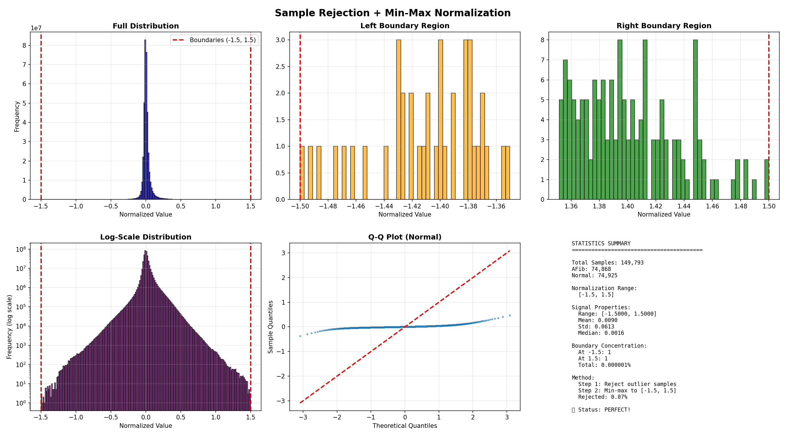 | 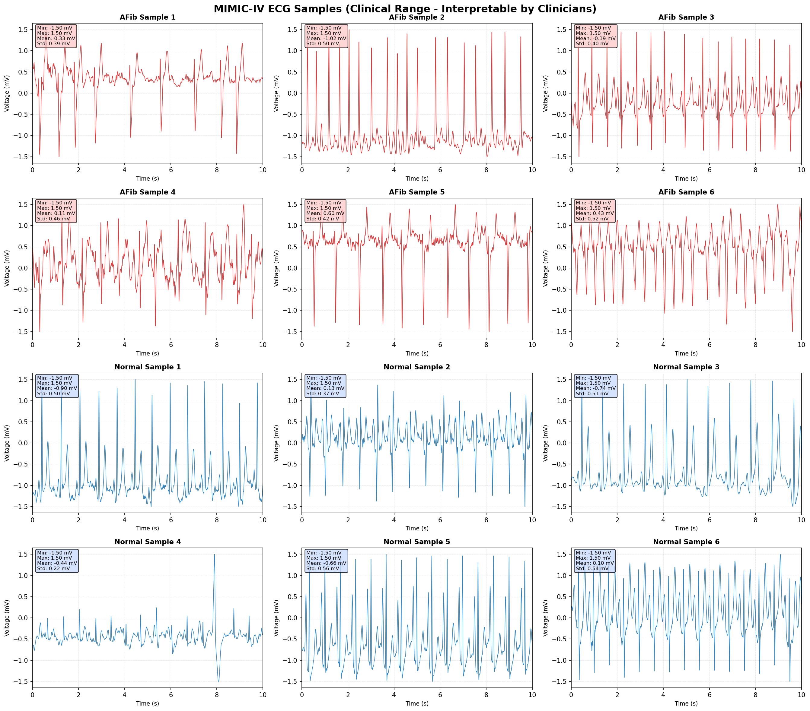 | 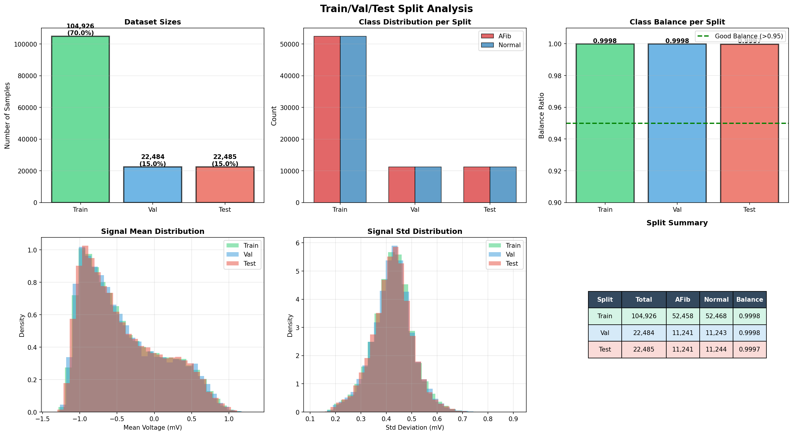 |

---

## Repository Structure

```
e20-fyp-ai-atrial-fib-detection/
│
├── diffusion_pipeline/                     # Diffusion-based augmentation pipeline
│   ├── final_pipeline/                     # ← START HERE: organized final pipeline
│   │   ├── README.md                       #   Execution guide and results
│   │   ├── src/                            #   All source code
│   │   │   ├── data_preparation.py         #     MIMIC-IV ECG loading & preprocessing
│   │   │   ├── classifier/                 #     ResNet-BiLSTM architecture & training
│   │   │   ├── diffusion/                  #     Two-stage diffusion model training
│   │   │   ├── generation/                 #     Counterfactual generation & filtering
│   │   │   ├── evaluation/                 #     Three-regime evaluation & statistics
│   │   │   └── utils/                      #     Shared model components
│   │   └── results/
│   │       ├── figures/                    #   All visualizations (73 figures)
│   │       └── metrics/                    #   Evaluation results (JSON)
│   │
│   ├── notebooks/                          # Development notebooks
│   ├── paper/                              # Research paper (LaTeX, PDF, figures)
│   ├── src/                                # Original source modules
│   └── scripts/                            # Helper scripts
│
├── Pipeline_Implementation/                # Phase 1: Classifier architecture experiments
├── pipeline_with_WGAN_XAI/                 # Earlier WGAN-based exploration
├── docs/                                   # GitHub Pages project page
└── week_4/, week_5/                        # Weekly progress logs
```

---

## Reproducing Results

All scripts are in [`diffusion_pipeline/final_pipeline/src/`](diffusion_pipeline/final_pipeline/src/). Run in order:

```bash
# 1. Data preparation — load MIMIC-IV, preprocess, split
python src/data_preparation.py

# 2. Train AFib classifier (ResNet-BiLSTM)
python src/classifier/train_classifier.py

# 3. Train diffusion model (two-stage, ~100 epochs)
python src/diffusion/train_diffusion.py

# 4. Generate counterfactual ECGs with plausibility filtering
python src/generation/generate_counterfactuals.py

# 5. Evaluate augmentation viability
python src/evaluation/three_way_evaluation.py      # Three-regime 5-fold CV
python src/evaluation/comprehensive_metrics.py      # Signal quality metrics
python src/evaluation/statistical_analysis.py       # TOST equivalence testing
```

**Hardware:** NVIDIA RTX 6000 Ada Generation (48 GB VRAM)  
**Training time:** ~21.6 hours (both stages combined)  
**Generation time:** ~4 hours for 22,469 samples  
**Model size:** 19.1M parameters  
**Dependencies:** PyTorch 2.0+, NumPy, SciPy, pandas, matplotlib, seaborn, NeuroKit2, wfdb, tqdm

> Model weights (`.pth`), datasets (`.npz`), and logs (`.log`) are excluded from this repository due to size. Trained weights are available on [HuggingFace Model Hub](https://huggingface.co/TharakaDil2001/diffusion-ecg-augmentation).

---

## Resources

| Resource | Link |
|---|---|
| 🤗 Model Hub | [TharakaDil2001/diffusion-ecg-augmentation](https://huggingface.co/TharakaDil2001/diffusion-ecg-augmentation) |
| 🤗 Live Demo | [ecg-augmentation-demo](https://huggingface.co/spaces/TharakaDil2001/ecg-augmentation-demo) |
| 📄 Research Paper | [Paper PDF](diffusion_pipeline/paper/paper.pdf) |
| 🌐 Project Page | [cepdnaclk.github.io/e20-fyp-ai-atrial-fib-detection](https://cepdnaclk.github.io/e20-fyp-ai-atrial-fib-detection/) |

---

## Acknowledgments

This work is part of the European project **SEARCH**, supported by the Innovative Health Initiative Joint Undertaking (IHI JU) under grant agreement No. 101172997. The JU receives support from the European Union's Horizon Europe research and innovation programme and COCIR, EFPIA, Europa Bio, MedTech Europe, Vaccines Europe, and additional partners.

---

## References

1. Ho, J., Jain, A., & Abbeel, P. (2020). "Denoising diffusion probabilistic models." *NeurIPS*.
2. Song, J., Meng, C., & Ermon, S. (2021). "Denoising diffusion implicit models." *ICLR*.
3. Ho, J. & Salimans, T. (2022). "Classifier-free diffusion guidance." *NeurIPS Workshop*.
4. Nagda, M. et al. (2025). "DiffStyleTS: Diffusion model for style transfer in time series."
5. Schuirmann, D. J. (1987). "A comparison of the two one-sided tests procedure." *J. Pharmacokinet. Biopharm.*
6. Thambawita, V. et al. (2021). "DeepFake electrocardiograms." *Sci. Rep.*

---

## Related Work

- [deepfake-ecg](https://github.com/vlbthambawita/deepfake-ecg) — Realistic ECG generation
- [Pulse2Pulse](https://github.com/vlbthambawita/Pulse2Pulse) — DeepFake ECG framework
- [SEARCH Project](https://www.search-project.eu/) — EU cardiovascular AI initiative

---

## Contact

**Supervisors:**  
Dr. Vajira Thambawita — [vajira.info](https://vajira.info/) · vajira@simula.no  
Prof. Mary M. Maleckar — Tulane University / Simula Research Laboratory

**Student Researchers:**  
Tharaka Dilshan — [e20069@eng.pdn.ac.lk](mailto:e20069@eng.pdn.ac.lk) · [LinkedIn](https://www.linkedin.com/in/tharaka-dilshan-237a8b345/)  
Nethmini Karunarathne — [e20189@eng.pdn.ac.lk](mailto:e20189@eng.pdn.ac.lk) · [LinkedIn](https://www.linkedin.com/in/nethmini-karunarathne-b20460206/)

---

## License

Apache License 2.0 — see [LICENSE](LICENSE) for details.
