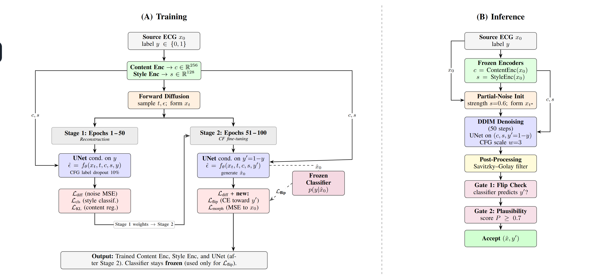
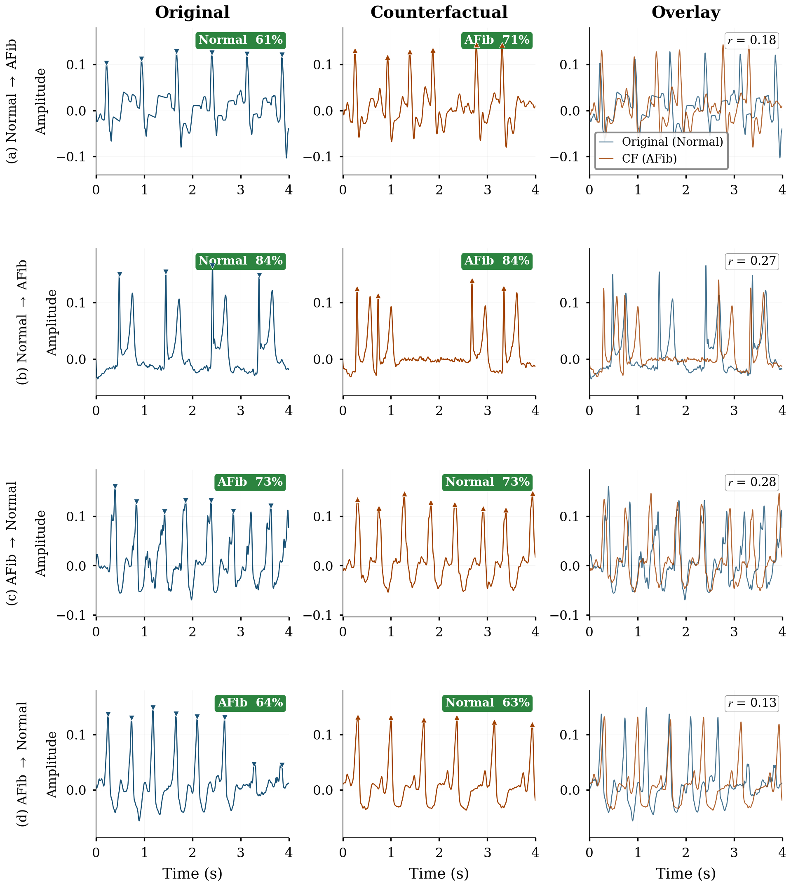
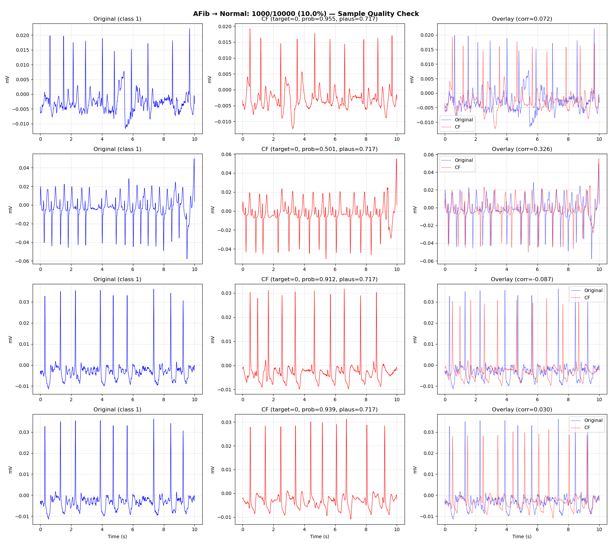
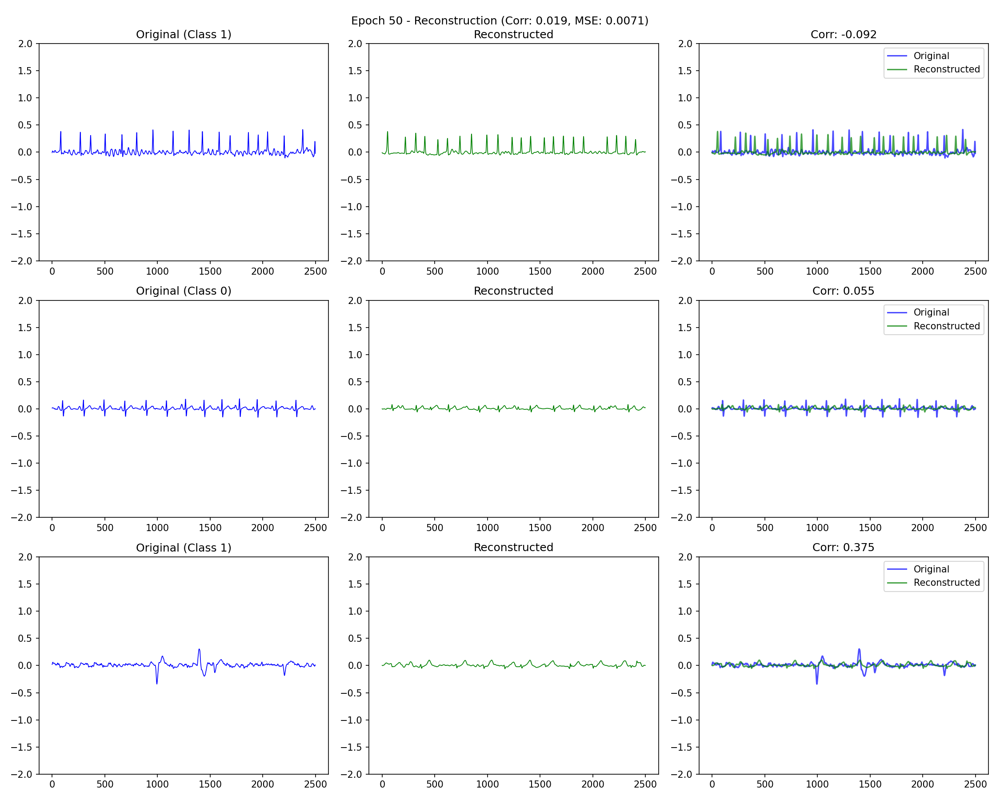
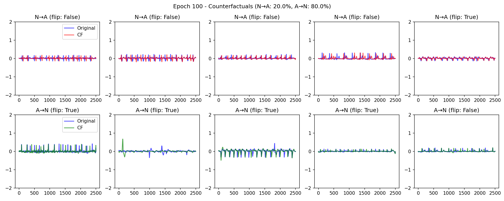
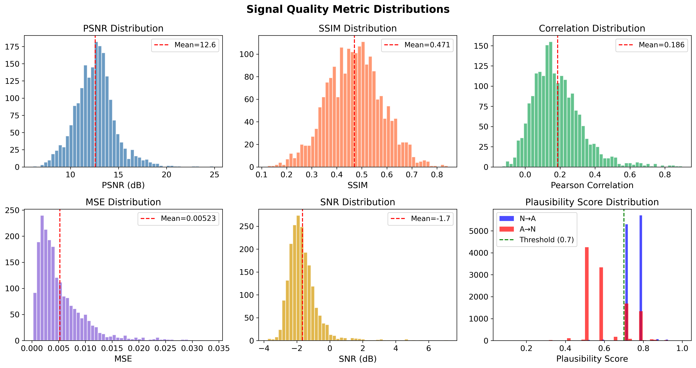
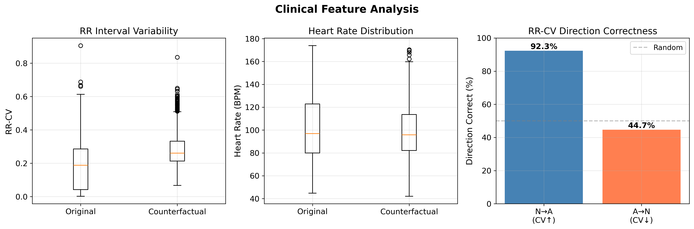
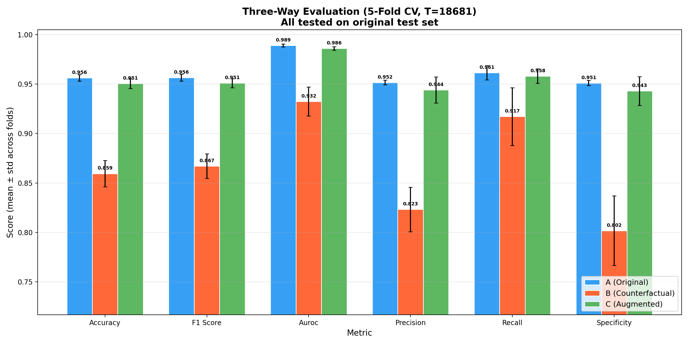
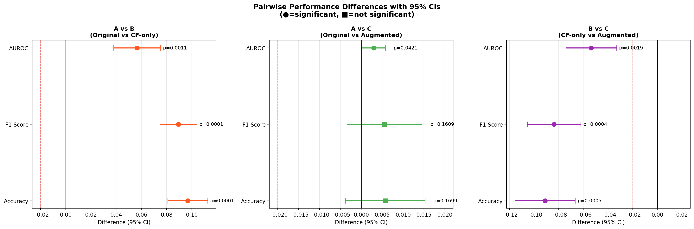

<!-- Hero Banner -->

  <h1>Diffusion-Based Counterfactual ECG Generation for Atrial Fibrillation Data Augmentation</h1>
  
Final Year Research Project — Group 29 · Department of Computer Engineering · University of Peradeniya

  

    
    
    
    
  

<!-- Key Result Highlight -->

  <strong>🔬 Key Result:</strong> Replacing 33% of real training data with diffusion-generated synthetic ECGs yields <strong>statistically equivalent</strong> classifier performance (TOST p &lt; 0.001, Δ = ±2%), with <strong>zero near-copies</strong> of training data among generated samples — enabling privacy-preserving dataset sharing and class balancing.

---

#### Team

  

    
Tharaka Dilshan

    
E/20/069 · Student Researcher

    

      <a href="mailto:e20069@eng.pdn.ac.lk">📧 Email</a>
      <a href="https://www.linkedin.com/in/tharaka-dilshan-237a8b345/">LinkedIn</a>
      <a href="https://orcid.org/0009-0006-1672-2317">ORCID</a>
    

  

  

    
Nethmini Karunarathne

    
E/20/189 · Student Researcher

    

      <a href="mailto:e20189@eng.pdn.ac.lk">📧 Email</a>
      <a href="https://www.linkedin.com/in/nethmini-karunarathne-b20460206/">LinkedIn</a>
      <a href="https://orcid.org/0009-0009-5459-7846">ORCID</a>
    

  

#### Supervisors

  

    
Dr. Vajira Thambawita

    
SimulaMet, Oslo, Norway

    
<a href="https://vajira.info/">🌐 Website</a> <a href="https://orcid.org/0000-0001-6026-0929">ORCID</a>

  

  

    
Prof. Mary M. Maleckar

    
Tulane University / Simula Research Laboratory

    
<a href="https://orcid.org/0000-0002-7012-3853">ORCID</a>

  

  

    
Dr. Roshan Ragel

    
University of Peradeniya

    
<a href="https://orcid.org/0000-0002-4511-2335">ORCID</a>

  

  

    
Dr. Isuru Nawinne

    
University of Peradeniya

    
<a href="https://orcid.org/0009-0001-4760-3533">ORCID</a>

  

#### Collaborators

  

    
Isuri Devindi

    
University of Maryland, College Park, USA

    
<a href="https://orcid.org/0009-0005-6615-7937">ORCID</a>

  

  

    
Prof. Jørgen K. Kanters

    
University of Copenhagen, Denmark

    
<a href="https://orcid.org/0000-0002-3267-4910">ORCID</a>

  

#### Table of Content

1. [Abstract](#abstract)
2. [Related Works](#related-works)
3. [Methodology](#methodology)
4. [Experiment Setup and Implementation](#experiment-setup-and-implementation)
5. [Results and Analysis](#results-and-analysis)
6. [Conclusion](#conclusion)
7. [Publications](#publications)
8. [Links](#links)

---

## Abstract

Automated detection of atrial fibrillation (AFib) using deep learning requires large, balanced ECG datasets, yet clinical data remains scarce, imbalanced, and constrained by privacy regulations. We present a **diffusion-based data augmentation pipeline** that generates synthetic ECG segments by transforming existing recordings into counterfactual waveforms of the opposing class. The pipeline uses a **partial-noise conditional denoising process** with **classifier-free guidance**, operating on single-lead ECG signals. A **content-style disentangled UNet architecture** separates class-invariant morphology from class-discriminative rhythm features. A **multi-stage plausibility post-validator** enforces morphological and physiological constraints and verifies rhythm consistency criteria, retaining only waveforms that satisfy quality thresholds.

We evaluate the generated counterfactual data through a **three-regime protocol** using a ResNet-BiLSTM classifier: training on originals only, counterfactuals only, and an augmented mixture. The augmented mixture achieves **95.05% accuracy** and **98.60% AUROC**, statistically equivalent to original-only training (95.63% accuracy, TOST p = 0.007, Δ = ±2%). Furthermore, **none of the accepted counterfactuals are near-copies** of training data (maximum correlation: 0.30), indicating the generated signals are novel and privacy-preserving.

  This research is conducted as part of the EU-funded <strong><a href="https://www.search-project.eu/">SEARCH Initiative</a></strong> through an international collaboration between the University of Peradeniya (Sri Lanka), SimulaMet (Norway), Tulane University (USA), and the University of Copenhagen (Denmark).

---

## Related Works

Generative models for ECG synthesis have been explored using GANs, VAEs, and more recently, diffusion models. The table below compares representative methods:

| Method | Model | Counterfactual | Key Limitations |
|---|---|---|---|
| PGAN-ECG (Golany et al.) | GAN | No | Limited rhythm diversity |
| WaveGAN-ECG (Donahue et al.) | GAN | No | Mode collapse on long signals |
| ECG-VAE (Biswal et al.) | VAE | No | Blurred morphology |
| CoFE-GAN (Jang et al., 2025) | GAN | Yes | Requires iterative latent inversion |
| GCX-ECG (Alcaraz-Segura et al.) | GAN | Yes | Weak morphology preservation |
| **Ours** | **Diffusion** | **Yes** | Single-lead; automated validation only |

  <strong>Key advantages of our approach:</strong>
  <ul>
    <li>Operates directly in waveform space — no latent inversion required</li>
    <li>Content-style disentanglement preserves morphology while modifying rhythm</li>
    <li>Multi-stage plausibility validation ensures clinical realism</li>
    <li>Formal statistical equivalence testing quantifies augmentation safety</li>
  </ul>

---

## Methodology

### Pipeline Overview

Our pipeline consists of five stages: data preparation, classifier training, two-stage diffusion model training, counterfactual generation with filtering, and three-regime augmentation evaluation. The figure below shows the complete training and inference pipeline:

  
  
<strong>Figure 1.</strong> Overview of the proposed pipeline. <strong>(A) Training</strong> proceeds in two stages: Stage 1 (epochs 1–50) trains the UNet for noise reconstruction conditioned on label y; Stage 2 (epochs 51–100) fine-tunes for counterfactual generation conditioned on y' = 1−y, adding L_flip and L_morph losses. The classifier is frozen. <strong>(B) Inference:</strong> partial-noise initialization, DDIM denoising with CFG, and two quality gates filter the output.

### Two-Stage Training

  <strong>Stage 1 (Epochs 1–50): Reconstruction</strong> — The content encoder extracts class-invariant morphological features (256-d VAE latent), and the style encoder captures class-discriminative rhythm features (128-d embedding). The conditional 1D UNet learns to denoise ECG signals with classifier-free guidance (10% label dropout).  
  <strong>Stage 2 (Epochs 51–100): Counterfactual Fine-tuning</strong> — The UNet is conditioned on the <em>target</em> class label (y' = 1 − y), while a frozen AFib classifier provides supervision through a flip loss, and a morphology preservation loss constrains deviation from the source signal.

### Inference Pipeline

1. **Partial-noise initialization** — Corrupt source ECG to 60% noise level
2. **DDIM denoising** — 50 steps with classifier-free guidance (scale w = 3)
3. **Post-processing** — Savitzky-Golay smoothing
4. **Gate 1: Flip verification** — Frozen classifier must predict target class
5. **Gate 2: Plausibility check** — Score P = 0.3·M + 0.3·Φ + 0.4·C ≥ 0.7
6. **Accept** — Output filtered counterfactual with verified label

### Content-Style Disentanglement

The architecture separates ECG signals into two representations:

| Component | Architecture | Output | Purpose |
|---|---|---|---|
| Content Encoder | 5 Conv layers + BatchNorm + VAE | c ∈ ℝ²⁵⁶ | Class-invariant morphology (beat shape, amplitude) |
| Style Encoder | 4 Conv layers + InstanceNorm | s ∈ ℝ¹²⁸ | Class-discriminative rhythm (RR regularity, P-waves) |

### Plausibility Validator

The plausibility score **P = 0.3·M + 0.3·Φ + 0.4·C** combines three components:

| Component | Criteria |
|---|---|
| **Morphology (M)** | Amplitude within ±3 norm. units, ≥3 R-peaks, QRS integrity, low spike rate |
| **Physiology (Φ)** | RR intervals within 0.3–2.0s (30–200 bpm), RR coefficient of variation < 0.6 |
| **Clinical Directionality (C)** | Normal→AFib: RR variability increase ≥30%; AFib→Normal: decrease ≥20% |

---

## Experiment Setup and Implementation

### Dataset

We use the **MIMIC-IV ECG Diagnostic Electrocardiogram Matched Subset** (PhysioNet), processing Lead II recordings:

| Property | Value |
|---|---|
| Source | MIMIC-IV ECG (PhysioNet) |
| Lead | Lead II |
| Sampling rate | 250 Hz (resampled from 500 Hz) |
| Segment length | 10 seconds (2,500 samples) |
| Filtering | Bandpass 0.5–40 Hz (NeuroKit2) |
| Normalization | Global min-max to [−1.5, 1.5] |
| Split | Patient-level 70/15/15 |

| Partition | Segments | Normal / AFib |
|---|---|---|
| Training | 104,855 | 52,447 / 52,408 |
| Validation | 22,469 | 11,239 / 11,230 |
| Test | 22,469 | 11,239 / 11,230 |
| **Total** | **149,793** | **74,925 / 74,868** |

  
  
<strong>Figure 2.</strong> Class distribution in the MIMIC-IV ECG dataset after preprocessing.

### AFib Classifier

A **ResNet-BiLSTM** classifier serves dual purposes: (1) style encoder guidance during diffusion training, and (2) downstream evaluation of generated ECGs.

- **Architecture:** Multi-scale CNN front-end → ResNet-34 → BiLSTM → Self-attention
- **Training:** Focal loss (α = 0.65, γ = 2.0), Adam optimizer (lr = 10⁻³), early stopping on validation AUROC
- **After training:** Frozen for all subsequent experiments

### Three-Regime Evaluation Protocol

To assess augmentation safety, we train identical classifiers under three data regimes:

| | Dataset A (Original) | Dataset B (CF Only) | Dataset C (Augmented) |
|---|---|---|---|
| Original ECGs | 18,681 | 0 | 12,454 |
| CF ECGs | 0 | 6,227 × 3 | 6,227 |
| CF fraction | 0% | 100% | 33.33% |
| **Training total** | **18,681** | **18,681** | **18,681** |

All classifiers evaluated on the same held-out **test set of 22,469 original ECGs**.

### Hardware & Training

  

    
48 GB

    
NVIDIA RTX 6000 Ada

  

  

    
21.6 hrs

    
Training Time

  

  

    
19.1M

    
Parameters

  

  

    
~4 hrs

    
Generation (22K samples)

  

---

## Results and Analysis

### Generated Counterfactual ECG Examples

Of 22,469 raw counterfactuals generated, **7,784 passed all quality gates** (34.6% acceptance rate), with equal counts from each conversion direction (3,892 Normal→AFib, 3,892 AFib→Normal).

  
  
<strong>Figure 3.</strong> Counterfactual ECG transformations. Normal→AFib (top rows) and AFib→Normal (bottom rows). Left: original signal; center: generated counterfactual; right: overlay with Pearson correlation. Green badges show classifier predictions confirming successful class conversion.

  

    
    
AFib → Normal (#1)

  

  

    
    
Normal → AFib (#1)

  

  

    
    
AFib → Normal (#2)

  

  

    
    
Normal → AFib (#2)

  

### Training Progress

  

    
    
<strong>Stage 1:</strong> Reconstruction (Epoch 50)

  

  

    
    
<strong>Stage 2:</strong> Counterfactual (Epoch 100)

  

### Signal Quality and Plausibility

  

    
0.76

    
Mean Plausibility Score

  

  

    
0.30

    
Max Nearest-Neighbor Corr.

  

  

    
0

    
Near-copies Detected

  

  

    
12.58 dB

    
PSNR

  

  

    
    
<strong>Figure 4.</strong> Signal quality distributions

  

  

    
    
<strong>Figure 5.</strong> Clinical feature analysis

  

### Augmentation Evaluation (5-Fold Cross-Validation)

| Training Regime | Accuracy | F1 Score | AUROC |
|---|---|---|---|
| **A** — Original only | 95.63 ± 0.33% | 95.65 ± 0.35% | 98.90 ± 0.16% |
| **B** — CF only | 85.94 ± 1.32% | 86.70 ± 1.24% | 93.24 ± 1.47% |
| **C** — Augmented (67% + 33%) | **95.05 ± 0.50%** | **95.09 ± 0.46%** | **98.60 ± 0.17%** |

  
  
<strong>Figure 6.</strong> Classifier performance across three training datasets. Error bars show standard deviation over 5 folds.

  

    
    
<strong>Figure 7.</strong> ROC curves (5-fold)

  

  

    
    
<strong>Figure 8.</strong> Confusion matrices (5-fold)

  

### Statistical Equivalence Testing

Formal statistical tests confirm that **Dataset C (augmented) is equivalent to Dataset A (original only)**:

| Test | N | Result | p-value |
|---|---|---|---|
| McNemar's test | 22,469 | Δ = 0.54% | < 0.001 |
| **TOST equivalence (±2%)** | 22,469 | **Equivalent** | **< 0.001** |
| **Non-inferiority (2%)** | 22,469 | **Non-inferior** | **< 0.001** |
| Dunnett's (A vs C) | 5 | No sig. diff. | 0.340 |
| Dunnett's (A vs B) | 5 | Sig. diff. | < 0.001 |

  

    
    
<strong>Figure 9.</strong> Augmentation viability analysis

  

  

    
    
<strong>Figure 10.</strong> Pairwise performance differences

  

### Key Findings

<ol>
  <li><strong>Augmentation is safe:</strong> 33% synthetic content yields statistically equivalent classifier performance (TOST p &lt; 0.001, Δ = ±2%)</li>
  <li><strong>Synthetic-only training retains 89.9%</strong> of original accuracy, confirming the model captures genuine rhythm-discriminative features</li>
  <li><strong>Zero privacy risk:</strong> No generated sample exceeds 0.80 correlation with any training example (mean: 0.30)</li>
  <li><strong>Clinical validity:</strong> Normal→AFib counterfactuals show increased RR variability; AFib→Normal show regularized rhythm</li>
</ol>

---

## Conclusion

We presented a diffusion-based counterfactual ECG generation pipeline that transforms single-lead ECG recordings into counterfactuals of the opposing class using a content-style disentangled architecture with partial-noise initialization and classifier-free guidance.

The goal of this work is not to improve classifier accuracy over original data, but to establish that **synthetic counterfactual data can safely substitute for or supplement real patient recordings** without degrading diagnostic performance. This is valuable in two scenarios:

<ol>
  <li><strong>Privacy-preserving data sharing</strong> — When original data cannot be shared across institutions due to patient privacy and consent restrictions</li>
  <li><strong>Data augmentation</strong> — When labeled data is scarce and augmentation is needed to improve model training</li>
</ol>

Evaluation on the MIMIC-IV ECG database (149,793 segments) confirms this goal:
- **TOST equivalence testing** establishes that augmented training yields equivalent performance within ±2% (p < 0.001)
- **Non-inferiority testing** confirms the augmented model performs within 0.54 percentage points of the baseline
- **Uniqueness analysis** confirms zero near-copies, validating the privacy properties

---

## Publications

1. Tharaka Dilshan, Nethmini Karunarathne, Isuri Devindi, Mary M. Maleckar, Jørgen K. Kanters, Roshan Ragel, Isuru Nawinne, Vajira Thambawita. "Diffusion-Based Counterfactual ECG Generation for Atrial Fibrillation Data Augmentation" (2025). *Under Review.*

## Links

- [Project Repository](https://github.com/cepdnaclk/e20-fyp-ai-atrial-fib-detection)
- [Project Page](https://cepdnaclk.github.io/e20-fyp-ai-atrial-fib-detection)
- [🤗 Model Hub](https://huggingface.co/TharakaDil2001/diffusion-ecg-augmentation)
- [🤗 Live Demo](https://huggingface.co/spaces/TharakaDil2001/ecg-augmentation-demo)
- [Source Code (PERA_AF_Detection)](https://github.com/vlbthambawita/PERA_AF_Detection)
- [Department of Computer Engineering](http://www.ce.pdn.ac.lk/)
- [University of Peradeniya](https://eng.pdn.ac.lk/)
- [SEARCH Project (EU Horizon)](https://www.search-project.eu/)

---

*This work is part of the European project SEARCH, supported by the Innovative Health Initiative Joint Undertaking (IHI JU) under grant agreement No. 101172997.*
